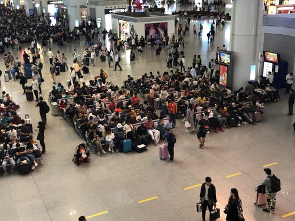
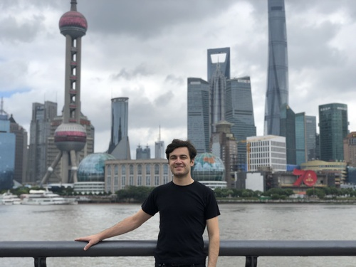
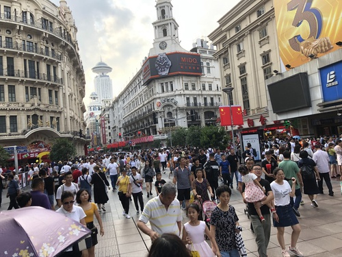
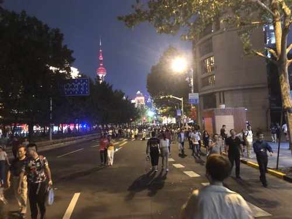
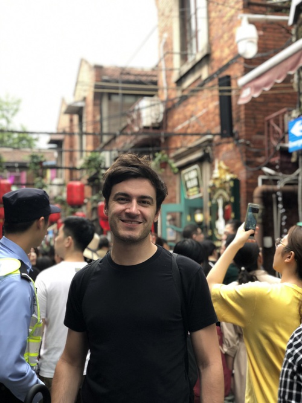
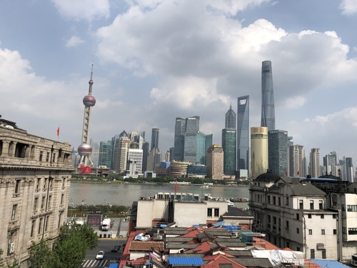

From October 1st to October 3rd 2019 I was in Shanghai with my American friend Jackie that I got to know some weeks ago in Beijing. We took the train from Beijingnan (Beijing South Railway Station) to Shanghaihongqiao. It was the first time for us both to use a high speed train in China. It was very interesting (有一色) as it is a different experience than travelling in Europe and America.

>Picture: Crowded Train Station

It starts with the process of buying the ticket. There is a travel agency called   "DIY Travel China"  which we used to book our tickets. Normally you have to understand Chinese to book tickets on a Chinese App or Website or you go to the counter on your own to get the tickets there. This agency takes care of that. They offer you a website where you can book tickets. The website itself is quite outdated. The service that they offer is quite good and in case you need some help they provide 24/7 support via Email. (Edit 2019-10-26: They charge you 10$ per ticket commissioning fee, I don't recommend anymore)

In front of the train station there were plenty of queues for the security check. To get in you have to identify yourself with your passport. Then your luggage will be scanned before you are allowed to pass. Entering the main hall there are plenty of queues in front of stairways that lead into the ground. Each stairway can only be passed after a entry gate has opened. The passengers have to scan in the ticket to go trough the gate. Therefore it is not possible that people spend too much time on the platform. Also it is not possible to jump in front of a train.

When sitting in the train it felt quite nice. The seats are big and have enough space for the feet. There is free wifi available and nearly everywhere from Beijing to Shanghai we had internet. No connection issues like in Germany. The train left the train station in time and arrived on point.

When we arrived in Shanghai in the evening it was raining a lot. So the first day we did just grab something to eat. The next day we went to the Bund. I was already in Shanghai some years ago. This time it was a public holiday in whole China and a lot of colleagues warned me that during that time it might be extremely crowded. On the first day it seemed to be a bit crowded compared to some years ago,...

> Me standing on the "Bund", the riverside in front of the Huangpu River.

The next day we saw how crowded a city can be during the so called Chinese Golden Week.

> The crowded Nanjing Road during Chinese Golden Week

As frustrating as it is sometimes to get from A to B when everyone else wants to do the same, I must say that I really like it when there is some action like this. It was a great atmosphere in the city. It felt a bit like in Stuttgart when Germany was winning the Football World Championsship in 2014. The Chinese were celebrating their country getting 70 years old.

> Crowded Streets near the Bund during Chinese National Holiday

One of the highlights in Shanghai was for me the Tianzifang (田子坊) Area. Plenty of small restaurants are waiting to be tried out there. There is a lot of Chinese Street Food and a lot of delicious bubble tea variations spread over crowded alleys.

>Tianzifang (田子坊) Alleys with a lot of restaurants

Also very nice is the Yu Garden that I have visited 2 years ago for the first time. I definetely can recommend to go there but better don't go when there are Chinese holidays. It was so crowded that a lot of alleys have been turned into one-way directed streets controlled and steered by security staff. What I did not like so much was that most of the touristic places seem to have the same shops, restaurants and the same overall concept. Everywhere is a well known coffee shop, two burger fast-food chains and the same applies for Chinese chains selling the same fried chicken wings, bubble tea, lamb sticks, etc. If you have seen one touristic foodie-town, you have seen them all.

> View on the Huangpu River from the Captain's Bar

If you want to have a bite in a place more unique then I would suggest you to follow the recommmendation of my friend Anna-Lena that told me definetly to go to the "Captain's Bar". It is a rooftop bar on top of a hostel. It is more or less for Western people, so don't expect some local secret location. But the view and the food there was really good and the service was worth to be mentioned here.