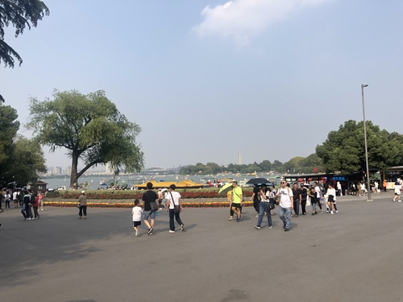
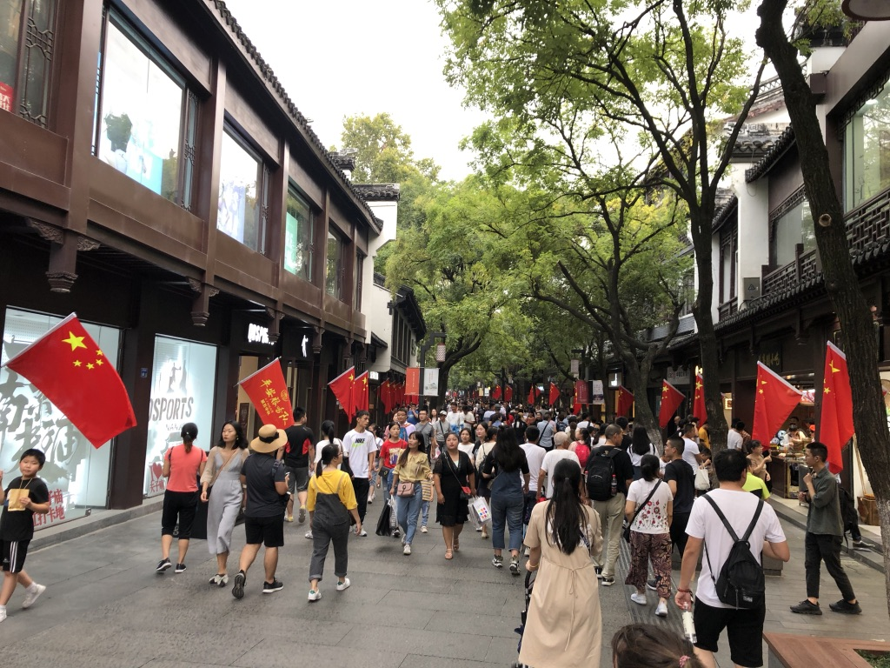
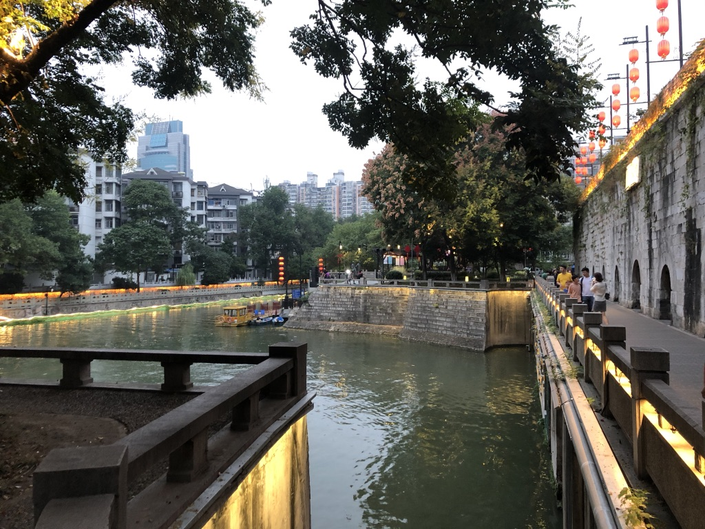

After Shanghai we did a one-day stop over in Nanjing. We arrived in the morning of October 4th 2019 This city is roundabout 1 hour away from Shanghai and less Western. Still a lot of people in Restaurants can speak Enlish. We stayed in a big international Hotel chain near the Xinmofan Rd. An American concierge gave us some advice what we could do in Nanjing. So we first went to the big lake nearby that she recommended. The lake itself was nice, but very similar to Beijing's summer palace. It seems like former Chinese emperors have had a big lake with a palace in the middle of it in every bigger city.

>The Nanjing Lake

The next recommendation on her list was the Jinmao Plaza. In Beijing there is a similar place and it seemed like it was also just a big shopping mall like the one there. However, this not really a sight. So from that point on, we decided to forget about the recommended points and just grabbed a bicycle (a shared one) to explore the city on our own. The first destination was the Confucius Temple and the surrounding streets.

> Nanjing Confucious Temple - The Streets around the Confucius Temple of Nanjing

The Temple it self was crowded, so we did not really want to wait in the queue. The alleys around were quite nice, but als already mentioned places like this seem to be similar. American Burger Places, Coffee Chains, Ice Cream from Denmark, the Chinese snacks that you get everywhere. Also Nanjing was quite croweded, as still most of the Chinese citizens have more or less vacation. Highlight of this area is a look on the small canal that is close to the temple. It is possible to do a boat tour there, but we skipped that as we did not really have the time for it. We walked besided the river a bit which is definetely a recommendation from me if you are there sometime.

> I recommmend to have a walk at the riverside of Nanjing

Next stop was the 192 Area, which was more or less a place for a lot of noble restaurants and international Restaurant Chains. Jackie was a bit disappointed at that time, cause everything seemed to be very commercial. Well, we took a Didi and went to the next stop: An islamic Chinese fusion restaurant that Jackie read about in some travel blog she read. For her surprise this place was not really for Western tourists. There was no English menu, no English speaking stuff and the whole place was self service. We had to pay upfront and then go to single cooking stalls located on one side of the restaurant. They offered dumplings （架子）, noodles （面）and other delicious local snacks. We found a table and sat together with a Chinese couple. Space is rare at this place.

After beeing totally satisfied after all this delicious food we took another shared bicycle without having a destination in mind. We just drove down the next big street and after a while we found some kind of art and museum district which was quite nice to have a look at. However at this time Jackie got already a bit tired from the day. And I have catched a cold. So it was time for us to leave for the hotel. On the way back we used a bike again and it was really nice to just let yourself go all the way down the streets without having to do anything than steering. Nanjing has some slight hills that we did not really recognize when going up. But the way down is so smooth after having done so many steps all over the day.

End of the story - Leon Sczepansky
