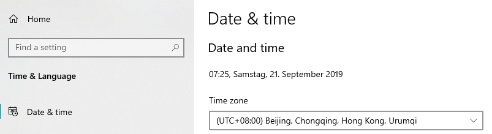
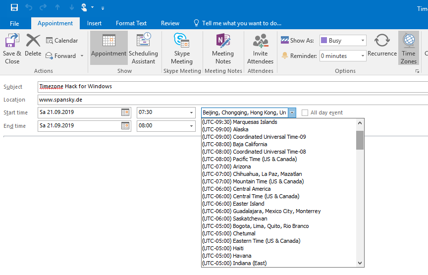
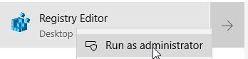
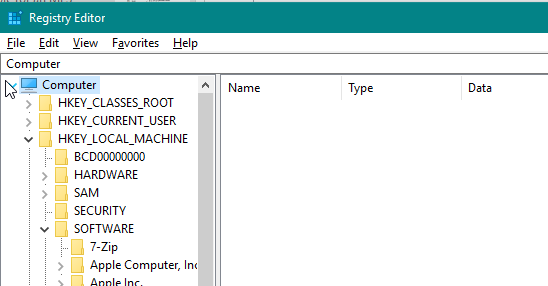
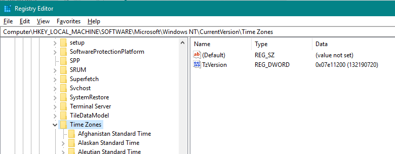
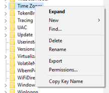
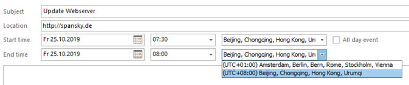

2019-10-15-Timezone Hack for Windows and Outlook

---
layout: post
title:  "Timezone Hack for Windows and Outlook"
date:   2019-10-15 00:01:00 +0800
categories: it
---

> Every business trip starts with a jetlag, also on my PC... :(

Most of my meetings either take place in Germany or in China - some via Skype. While for organizing a meeting it is not really necessary, it is a an absolute must for me to adjust the time zone of windows or outlook after travelling. For this I have to select between a lot of options, including the Easter Islands, etc. Can you remember your last meeting with colleagues from the Easter Islands?

> Have you been to the Northpole recently? No? Then this productivity hack is for you. If those time zones are not needed on your PC, why should you always scroll through this long list? Let‘s get rid of them.

How to remove timezones in Windows
------

1. Get yourself adminrights or find someone who has them for your PC
2. In Win10 search for "regedit.exe"...
    
    

3. ...and execute it as admin.
    
    

4. Navigate trough this structure...
    
    

5. ...to the folder HKEY_LOCAL_MACHINE\SOFTWARE\Microsoft\Windows NT\CurrentVersion\Time Zones...

    

6. Do a backup of the folder with the "Export" function (Save it to somewhere where you find it, whenever you go somewhere else and need that timezone again)...
    
    

7. There you will find a folder for every Time Zone. Just delete the ones via rightclick, that you do not want to keep 🙂 Done! In the end your outlook will look like this and windows does only show options that you really need.
    
    

