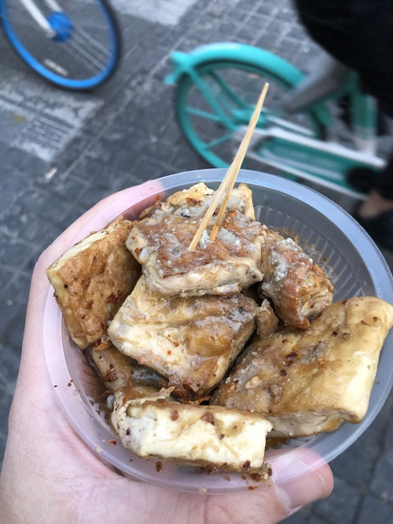
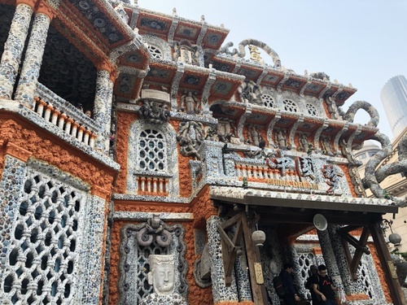

2019-10-20-Trip to Tianjin

---
layout: post
title:  "Trip to Tianjin"
date:   2019-10-20 00:01:00 +0800
categories: travel
---

Day 1 started a bit in a panic mode. One hour before our train left Beijing, my dear friend and colleague Anna-Lena got a message that our hotel was cancelled. On the way to Tianjin we booked our new Hotel „100Inn”. This hotel was not only cheap it looked and felt also very cheap. However everything was fine and the staff was friendly.

On the first day we went to eat in a Tianjin mini restaurant where you pick all your meal ingredients on your own. A perfect place for vegans (Anna-Lena) and non-vegans (me).

> Place to eat 

After having dinner there we asked for a bar recommendation and finally headed to the “we brewery”. This bar is a place obviously liked by foreigners in Tianjin and has a good choice of own crafted beer, IPAs and cheap cocktails. We recommend a visit if you want to get some advice by other foreigners what to do in Tianjin. We got to know Paul there, a teacher in his end 30s having very special views on the world history (& conspiracies). A interesting talk, but after hearing about some very questionable theories (he called them facts), it was time for us to go. Arrived in the hotel we got ourselves a robot massage and went to bed.

Day 2. Like in most Chinese cities there is a historic / ancient cultural street full of souvenir shops, bubble tea stores and fast food stalls. We went there for eating good breakfast but ended up eating stuff that was just not very tasty, but sweet as f. For lunch we took a Didi to the “Twin Lotus Vegetarian Restaurant” (Bingdilian) that offers also a lot of meat (hm...). However the veggi dumplings were great.

>Anna-Lena and me loved that tofu.

For coffee we stopped by at the “104 Hive Club”: A great place for having a break and writing the first half of this article.

Then we had a stop in the “China House Museum” a house that looks like it is completely built from broken Porcelain bowl and teapots. Interesting to see. After that we ate some streetfood nearby the big shopping malls and walking streets. Our favorite was the tofu stall in a small food street.

> China House Museum - A house built out of porcelain. Fancy.

In the evening we explored the area around the sports museum. Our highlight was a very small bar specialized on Japanese Whiskey / Sawa. This bar will propably be in tourist guides in the future. After one glass of excellent whiskey we continued our night in a Chinese fruit liquor restaurant.

Day 3 started with having breakfast in a Jianbing shop. This dish was highly recommended by my Chinese work colleague born in Tianjin. Even you can get it in Beijing, you should try the original ones. I agree. It was tasting great. As a next stop we headed to the Tianjin Eye.

> Tianjin eye by night

The big fairing wheel reaches higher than most of the Tianjin buildings and gives a great view over the city and the river. Unfortunately the pollution on this day was a bit bad. Still we enjoyed the ride. From there we took a tourist boat to get to other places and then home to Beijing.

End of the story - Leon Sczepansky

