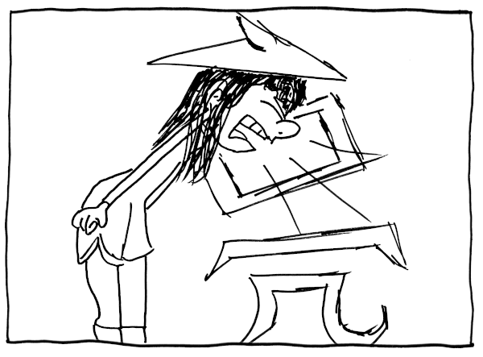

2019-11-23-Chinesisch lernen mit System

---
layout: post
title:  "Chinesisch lernen mit System"
date:   2019-11-23 00:01:00 +0800
categories: mandarin
---

Als ich vor 4 Monaten angefangen habe, Chinesisch zu lernen, bin ich davon ausgegangen meine Lehrer würden mir eine Methode vermitteln wie ich die vier Töne perfekt unterscheide, die zig tausenden Schriftzeichen beherrschen kann und innerhalb von zwei Jahren halbwegs fließend spreche. Die vorherrschende Herangehensweise scheint allerdings zu sein, einfach einem Lehrbuch zu folgen und die dort gelernten Wörter so oft zu trainieren, bis sie sich von selbst irgendwie ins Gedächtnis einbrennen. Freunde von mir, die chinesisch an einer Hochschule in China gelernt haben, berichten von täglich 8 Stunden Unterricht, bei denen Schriftzeichen einfach von Radikal zu Radikal (quasi von A bis Z - nur deutlich mehr) solange wiederholt aufgeschrieben werden, bis sie sitzen. Ohje. Vielleicht erwarte ich einfach zu viel von Lehrern. Als ich Englisch und Französisch in der Schule gelernt hab, lief es ja auch nicht anders. Fleißig Vokabeln pauken oder einfach üben üben üben (oder wie damals bei mir englischsprachige Computerspiele spielen). However, Computerspiele sind für mich nichts mehr und das klassische Vokabelheft mit den zwei Spalten scheint mir mit den ganzen Schriftzeichen auch nicht mehr das Wahre zu sein.

__Das Ziel:__ In zwei Jahren fließend in Wort und Schrift sein (im Büro und Alltag). Der Wortschatz sollte dafür mindestens 1000 Zeichen umfassen. So viel braucht man wohl, um eine Tageszeitung zu lesen.

Wie will ich dorthin kommen? Als ITler sollte mein Unterricht idealerweise unter Einsatz von digitalen Hilfsmitteln (Handy, Tablet) stattfinden. Durch meinen täglichen Arbeitsweg von 2,5h auf der Rückbank vom Taxi ist Papier und Stift auf alle Fälle zu vermeiden. Zu lernende Wörter sollten für meinen Alltag relevant sein und damit learning-by-doing ermöglichen. Das geschriebene Wort sollte Priorität vor dem gesprochenen Wort haben. Und am allerwichtigsten: Das Lernen sollte einer Methode folgen.

__Los geht's:__ Wie schon erwähnt, die vorherrschende Lernmethode scheint das Reinprügeln von Vokabeln zu sein. Nicht mein Stil. Also ging ich auf die Suche nach Alternativen. Den Anfang machte ich mit der __Recherche nach Apps:__ Meine täglichen Tools sind unter anderem __Pleco__ als digitaler Wörterbuchersatz. Die App bietet Zugriff auf ein Offline-Wörterbuch und beinhaltet auch Texterkennung aus Fotos, eine Lernfunktion und andere nützliche Sachen. Hauptsächlich nutze ich es für das Nachschlagen von Vokabeln. Der Rest ist mir ein wenig zu kompliziert umgesetzt. Die App __Skritter__ nutze ich als digitales Vokabelheft. Neue Wörter, die mir Kollegen und meine Lehrer beibringen, lassen sich dort erfassen und trainieren. Der Clou der App ist, dass sie einem täglich ausrechnet, welche Wörter auf Aussprache, Bedeutung und Schreibweise überprüft werden müssen. Die fünf verschiedenen Töne(vier Töne + neutraler Ton) werden per Wisch eingegeben, die Schriftzeichen werden per Finger aufgemalt und meist recht gut erkannt (dann seltenere Wiederholung) oder halt auch nicht (dann taucht das Wort in der nächsten Taxifahrt definitiv wieder auf). Diese Methode nennt sich __Spaced Repetition__. Je nachdem wie sehr man selbst die Schwierigkeit der Wiederholung auf einer Skala von 1 (man ist absolut auf dem falschen Dampfer) bis 4 (frag mich bitte nicht so etwas leichtes) einstuft, rechnet das System aus, wann das Wort wieder drankommt. Yeah! Das Abfragen und Wiederholen folgt damit nicht nur einer Methode, sondern sogar einem Algorithmus. Das macht mich als ITler happy, ist leider aber auch noch nicht der heilige Gral des Chinesisch-Lernens. Denn irgendwie muss ich mir ja ein Wort erst einmal einprägen, bevor ich es wiedergeben kann. Im Chinesischen geht das ganz gut über __Eselsbrücken__. Nur find mal jemand eine Eselbrücke für das einfache Wort 亮 (liàng - leuchten, erscheinen, scheinen, klar, ...), das sowohl Aussprache/Pinyin , einen der Töne ( ˋ ist der zweite Ton), die Bedeutung (zig verschiedene Bedeutungen je nach Kontext) und die Komponenten des Schriftzeichens wiedergibt. Meist wird irgendeine Eselbrücke gewählt, die nur die Schreibweise oder Aussprache (und ich rede noch nicht vom Ton) widerspiegelt. Wenn man aber Schrift, Aussprache, Ton, und Bedeutung hinkriegen will, wird es schwierig. Immerhin bin ich nach einiger Recherchezeit auf eine __Methode__ gestoßen, die fast alles hinbekommen will und theoretisch echt alles abdeckt.

__Ein System um Eselsbrücken zu bauen: die People-Places-Objects-Methode.__ [Hier](http://www.braingain.se/chinese/) bin ich auf einen Artikel aufmerksam geworden, der sich auf eine Studie stützt und die Vorgehensweise vorstellt. Nehmen wir die Silbe liàng (das ist die sogenannte Pinyin-Schreibweise) auseinander, so gibt es einen Silbenbeginn (Initial) „l“ und die Endung „iàng“. Nimmt man das Wort „shǎo“ (少), kann man es in „sh“ und „ǎo” aufdröseln. Alle chinesischen Schriftzeichen werden aus einem von 24 Initialen gebildet und von einer aus 35 Endungen. Die PPO-Methode macht daraus eine von 24 Personen (Schauspieler) und eine von 35 Locations.

So wird aus lìang meine Freundin Linda (fängt auch mit L an), die in der Pizzeria (iang) einen ordentlichen Nieser absetzt （口 - Mund）und die Tischdecke （冖）vom Tisch （几）weht. Linda ist Hutträgerin (亠）. 亮 Wo genau dort? Das verrät der vierte Ton (der geht nach unten). Linda ist in der Nähe der Toiletten/Abstellkammer (gilt für alle meine Indoor-Locations) in der Pizzeria. Da (Kammer) ist es häufiger mal staubig vom ganzen Mehl. Wer sich solch eine Story aufbaut kann einfacher die Eselsbrücke bauen und wiedergeben.

> Meine Eselsbrücke für 亮 - Linda niest in der Pizzeria und fegt das Tuch damit vom Tisch.

Man muss sich nur vorstellen, das ganze wäre wirklich passiert. Die Story sollte also möglichst realistisch sein, dennoch darf ordentlich übertrieben werden und eingebaut werden, was hilft. Wer keine Freunde hat, nimmt Schauspieler (so ists in der Studie beschrieben) oder wer Comicfan ist, nimmt Comicfiguren. Du hast keine Pizzeria vor Augen (das ist wichtig für die Visualisierung der Stories), dann nimm die WGs deiner Freunde, die Supermarktketten in deiner Nähe. Wichtig ist, dass sich alles unterscheiden lässt und in meinem Fall wieder einem System folgt. Alle Locations mit „I“ am Anfang sind Restaurants oder Kneipen. Alles mit U ist irgendein „Untergrundclub“. Alle E‘s sind WGs. Alle Finals mit a sind öffentliche Plätze.

Meine Ex-Nachbarin und Freundin Steffi posiert für 少 ( shǎo) mit zwei Freunden am Schlossplatz vorm Schloss (sh - Steffi, ao - Schlossplatz, drǐtter Ton - Osten, da wo das Schloss ist) für ein Foto und irgendwer springt noch rein, um auch auf dem Bild zu landen. Outdoor Locations folgen dem Prinzip: vier Töne, vier Himmelsrichtungen. Den neutralen Ton gibt es kaum (im Zweifel in der Mitte vom Platz). Steffi und ihre Freunde posieren in meiner gefaketen Erinnerung dann ungefähr so:

> Meine Eselsbrücke für 少 - Steffi posiert mit Freunden vorm Schloss und irgendwer springt noch rein.

Die Idee meine Freunde für meine ganzen Vokabeln zu „benutzen“ ergab sich bei mir aus dem Problem, dass ich kaum Schauspieler kenne, bzw. keine 24 einprägsamen. Alle Orte und Personen (mit wenigen Ausnahmen) wohnen oder waren mal in Stuttgart. Sollte ich mal japanisch lernen (vlt. taugt da eine ähnliche Methode), werde ich eine andere Stadt wählen. Vlt. kommen dann meine Arbeitskollegen aus Peking in Frage :)

Auch bei dieser Methode gibt es noch ein Manko. Da Schriftzeichen mehrere Bedeutungen haben können und es fast unmöglich ist, ohnehin alles zusammenzubringen, wird an diesem Ende gespart. Da Chinesisch sehr vom Kontext abhängt, ist die Bedeutung pro Vokabel bei mir nicht in der Eselsbrücke enthalten. Ganz ohne Pauken geht es also nicht. Ab und zu ist es auch schon vorgekommen, dass Pinyin und Ton gleich sind (zaì - 在, 再- zaì）. Das hat die clevere Studie und auch der Blogger leider nicht erwähnt. Das Schöne ist aber auch, dass diese Eselsbrücken nur eine Stütze sind. Irgendwann brennt sich das Schriftzeichen fast von selbst ins Gedächtnis ein.

Sollte es irgendwem helfen, hier meine Liste mit den Orten (sieht wohl auf dem Handy nicht so gut aus, kümmere ich mich ein ander Mal drum):

Final|Ort
-----|-----
a|Marienplatz
ai|Bihlplatz
an|Schlossgarten
ang|Eugensplatz
ao|Schlossplatz
e|Beate WG
ei|Linda’s WG
en|Madeleine’s WG
er|Jones
i|Irishpub
ia|Mata Hari
ian|Kottan
iang|LA Signorina
iao|Arrigato
ie|Bergamo
in|Bonnie
ing|Burger King
iu|Kap Tormentoso (u für unten)
iong|Süßholz
o|Rewe
ong|Edeka
ou|Lidl
u|Dresden
ua|Rakete
uai|White Noise
uan|Bar Romantica
uang|Zwanglos
ue|Delayla
un|Cafe Adria
uo|Kowalski
ui|Wilhelmspalais
ü|Teehaus
üe|Aussichtbar
ün|Karlshöhe

Und zu guterletzt noch meine Freunde, die mich mit Eselsbrücken gerne auch ausstatten dürfen, um mir ein wenig unter die Arme zu greifen. Wenn mir mal nichts einfällt, seid ihr gefragt :)

Von daher danke an Berta, Corny, Christin, Daniel, Elli (neutraler Initial, ja auch sowas gibt‘s), Felix, Glitzerfee, Heisler, Josef, Kashmirali, Linda, Mymi, Nina, Papa, Jones (für das chinesische Q), Resi, Samira & Sandra, S(h)teffi, Timon, Zhao, Wero, Xiao, Yannik und Frau Zörner.

Sollte es mir jemand nachmachen wollen und sich schwer damit tun, die 24 Leute zusammenzukriegen, hilft ein Blick in die Kontakte des Smartphones. Bei X und Zh muss man eventuell Freundschaft mit dem Personal eines China-Restaurants schließen :)

Viel Spaß beim Lernen.

