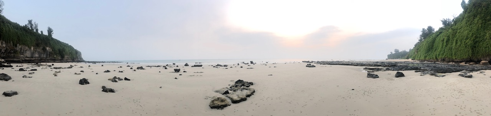
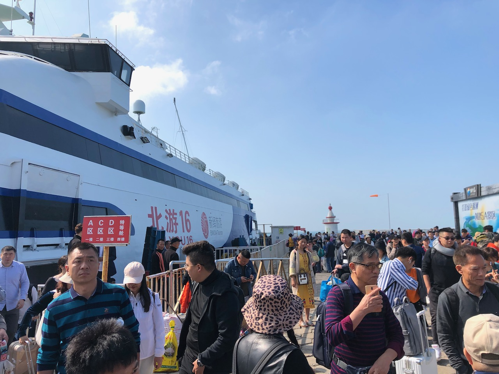
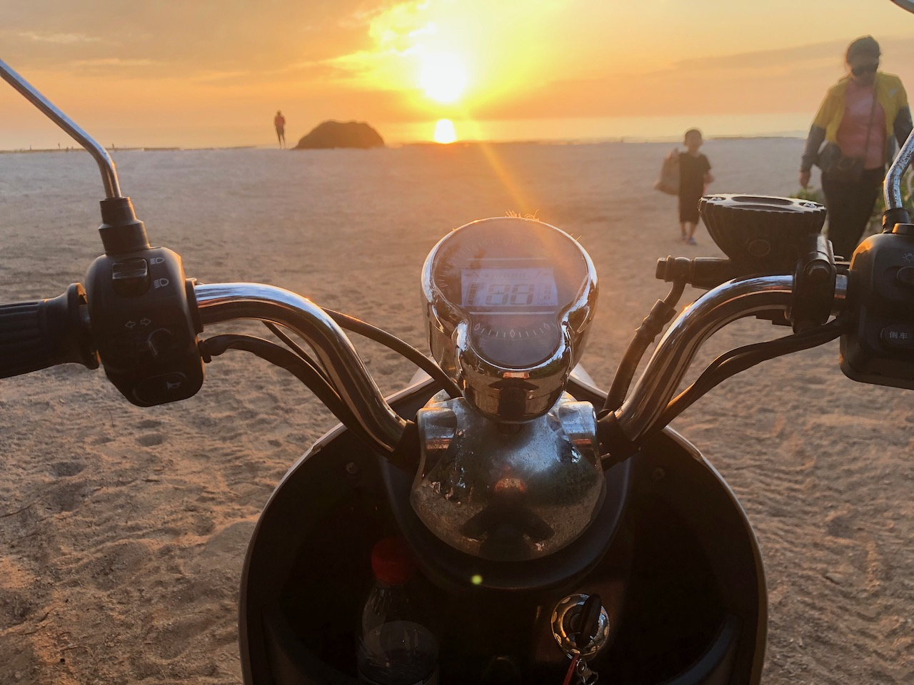
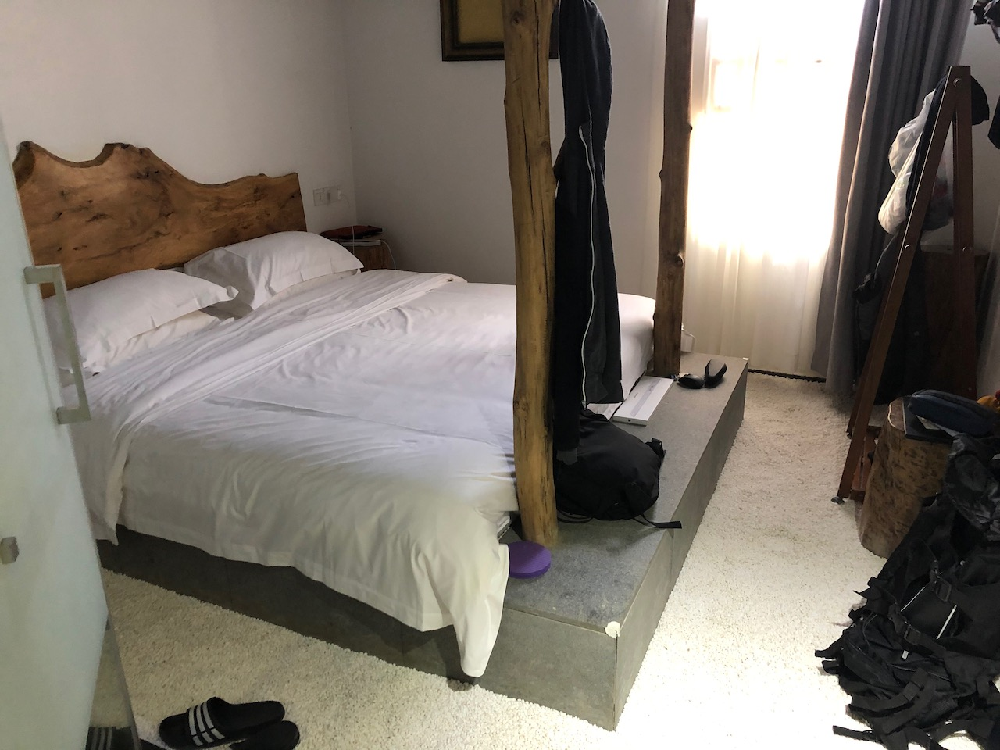
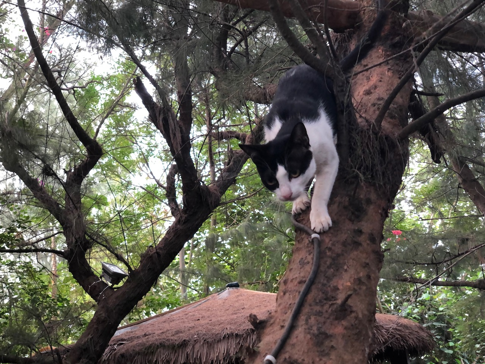
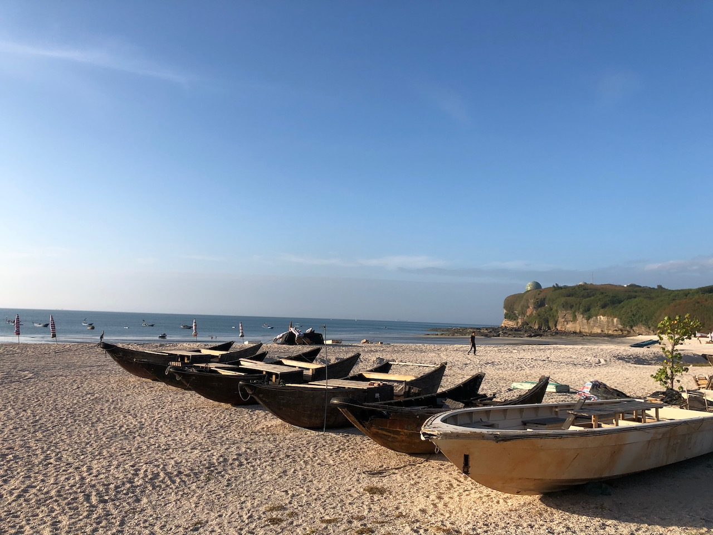
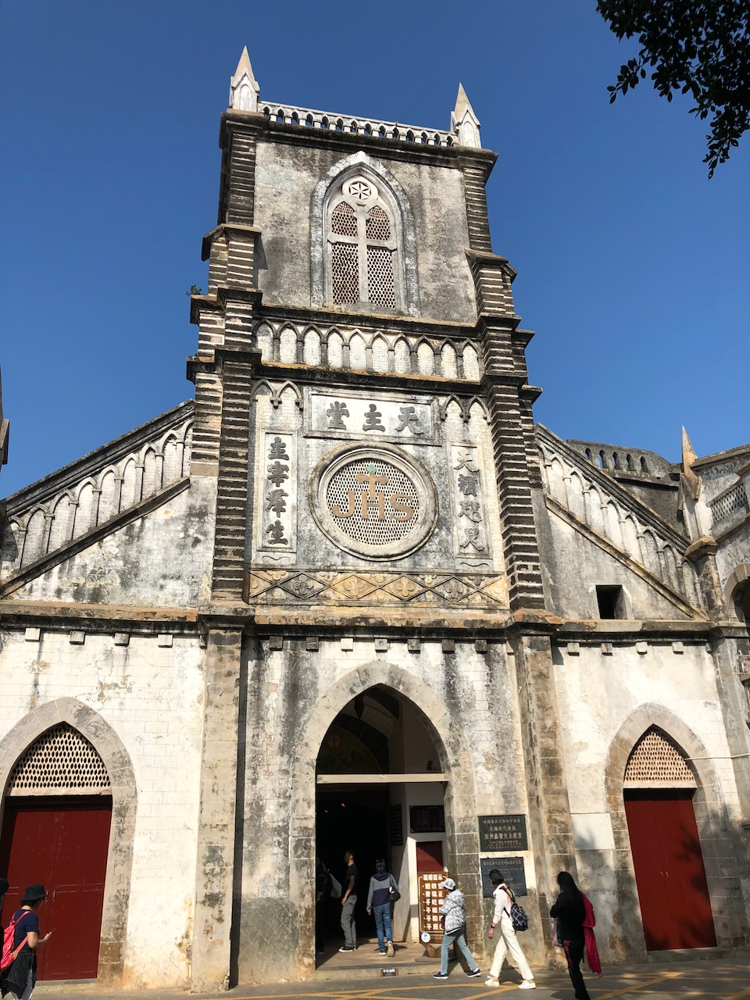
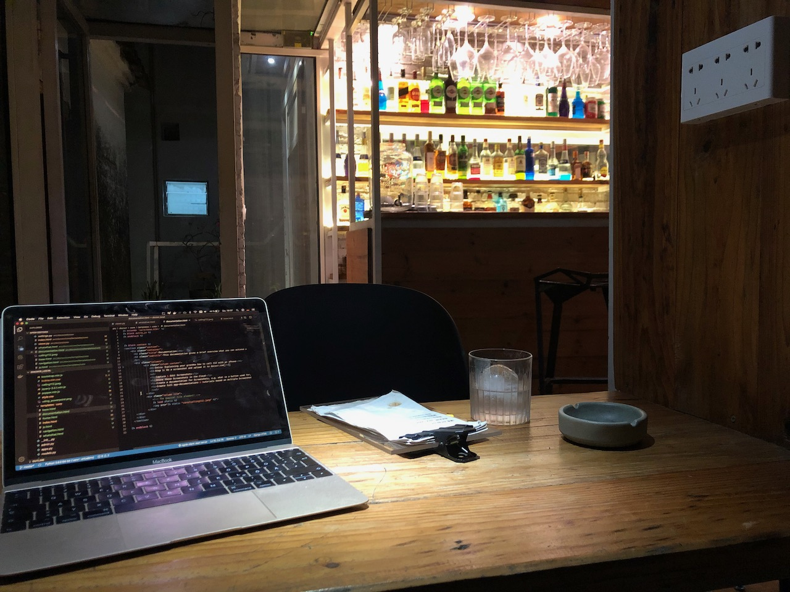

2019-12-17-Weizhou Dao

---
layout: post
title:  "Weizhou Dao"
date:   2019-12-17 00:01:00 +0800
categories: travel
---

> This post is coming more than 1 month after I have written it, cause it took some time to update some website stuff here and search trough my pictures, etc....)

Introduction
----

After a long time working in Beijing it’s time to have vacation. I decided to go somewhere where it is warm and dry, not too far away and where I could relax and read a lot. Also I wanted to work on my website. 

Where to do that? Actually I wanted to go to Beihai because there is a branch of the language school that my prior Chinese teacher worked for. First I booked the flight and then the next day I booked the hotel and totally did not consider to spent any attention on the location of the hotel. I thought maybe this time I try out something quiet, not directly in the city center. So I booked the hotel with the best pictures and did not read about that it is not really in Beihai. It was 50km away...

...on an Island called Weizhou Dao. First I was a bit shocked when the hotel staff was calling me to arrange a pickup from the Islands port. That was when I found out about my Island trip. But then I was excited, because this Island seemed pretty unknown to tourists (Western tourists). I thought I would maybe be the only tourist there at all because its December and only a few people from China go on vacation. However in some aspects I was wrong, in some I was totally right. 

Getting there
-----

I took a plane from Beijing to Beihai which takes about 4 hours time. Arrived in Beihai I spent there one night and on the next day I asked the Hotel staff to help me get a taxi to the port. There I realised that I was definetely not the only person aiming for having a nice time on the Island. But at least I was the only western foreigner there. 

I was in Beijing, Shanghai, Guilin, Tianjin, Nanjing, Kunming, Lijiang and there were always other foreigners. There was always a Starbucks, a McDonalds, KFC and you could somehow with English manage your way around speaking Chinese. This time Starbucks is 50km away and it takes you some effort in Chinese to get a coffee. There is no Irish Pub where you meet people from the USA to have a chat, no hostels, nothing western at all. So this time I needed to practice my Chinese.

Hotel Area
----

Located directly next to the south beach of the Island my accomodation allowed to see the sunset and to go out to catch some crabs when the tide is low. That’s what I did on day two with the hotel staff together. It was a great idea from them to ask me if I want to join. I will definitely recommend my hotel to anyone who plans to come here too. The room itself is very tidy and modern, but also very simple. There is only a bed and a bathroom. 

The hotel is offering a really nice outside area with plenty of massive tables outside next to the beach. The kitchen seems to be open only at certain times which is ok, because most of the times you will be motorcycling somewhere else. If you hate cats you should propably look out for another hotel, because there are cute kitties  everywhere. 

If you are vegetarian / vegan, you should look for alternatives when it comes to supper / lunch.

E-Scooter Adventure
-----

If you are used yet to rent a scooter on vacation, you will be happy to try the ones on Weizhou Dao.
Most of them are electric and for these kind of machines foreigners do not need any driving license. You can just rent one for around 40-50 yuan a day. One charged battery allows you to completely go around the Island, so don’t worry. You will not get stuck somewhere. Sitting on a scooter it is very convenient to explore the different parts of the Island. Some highlights…

The __south crocodile mountain bay__ is the place where the volcano that built this Island is most visible still. You can see the stone frozen lava leaping into the ocean. There are still some craters that you can fall in and therefore a lot of warning signs. A lot of Chinese tourists are taking selfies there because the beach looks very unique to other beaches. The stones have a red color and the walking track is looking nice with its wooden style.

One of the main areas to go dining is located in the __eastern bay area__. There you also find some bars, but as I have to use the E-Scooter to get back into the South I did not really try to have a drink there. It seems like most of the bars offer the same drinks. Mostly beer. Therefore I think I did not really miss so much. But what I could recommend there was to visit a seafood restaurant. I chosed the most crowded one as I thought this might be a sign of quality, but maybe it was just crowded because everyone else folllowed the first guy on this day who stopped by there. Maybe… Another good reason to go to this bay is that you will find some shops that sell coffee. In my hotel they don’t serve coffee which might be for some people a big no go. For me… well I don’t care whether I have my coffee for breakfast or some hours later. 

A nice spot to have a break and go to a local market is the __Catholic Cathedral__. There you can eat tasty rice flour buns, stir fried pizza-like seafood bread and just have a look at this beautiful church which also has a nice church garden. 

An Island for shooting photos
----

When I arrived at the port of Weizhou Dao I was soon sitting together in the same group taxi with a couple that I saw just for a short time. I saw them arriving on Sunday and I saw them going one day later. They arrived with a big luggage and so did a lot of other Chinese tourists aswell. What most of them seem to do on this Island was to take pictures. The full bag is full of clothes that they will change for every location (sometimes for one location they bring multiple clothes). It’s a pitty that it seems to be quite common that people really just come here for one or two days. Arrive in the evening, have dinner, do some crab catching, go to sleep, see the sunrise, do some pictures at every sight, go home. That’s what most tourists here do. It seems like a big struggle to be a Chinese „just married“ couple. With the few vacation days that people have there seems to be a big pressure to post beautiful pictures on Weixin (Wechat). 

Nice Bars, Nice Coffee Places
----

One day before I left I actually found the best spots for having a great coffee and some nice drinks. I really regret not have found these places before. It looks like I would have been able there in the evening to work a bit on my website. This was not so easy in the hotel, because there was no desk that I could use and to work on my laptop while lying in the bed is very uncomfortable. 

For me even one week was not enough. So much I fell in love with this Island. 

