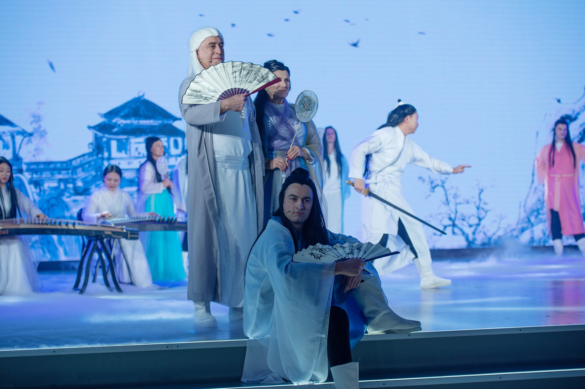

For the Chinese New Year it is quite normal that Chinese companies have a party with all employees. There was a group of expats which I joined and we have sung the following song there. Just in case you also want to sing it I have posted the text here for you.

Song:
----
* [Link - Neatease](https://music.163.com/song?id=1411532260&userid=1953659657)
* [Link - QQMusic](http://url.cn/5Zdc0So)
* [Link - Youtube](https://www.youtube.com/watch?v=6XE0W2KvD0Q)

Lyrics:
----
<pre>
沧    海   笑   滔  滔   两   岸  潮
cāng hǎi xiào tāo tāo liǎng àn cháo
A Laughter From The Seas，The seas laugh, lashing on both shores

浮  沉   随   浪  记  今   朝
fú chēn suí làng jì jīn cháo
Carried in the waves, we have only the here and now

苍    天    笑   纷  纷  世   上    潮
cāng tiān xiào fēn fēn shì shǎng cháo
The heavens laugh at the troubled world

谁    负  谁    胜   出   天  知   晓
shéi fù shéi shèng chū tiān zhī xiǎo
Only they know, who is to win and lose

 江    山    笑   烟  雨  遥
jiāng shān xiào yān yǔ yáo
The mountains laugh, the rain is afar

 涛  浪   淘   尽  红    尘  俗  世  知   多  少
tāo làng táo jìn hóng chén sú shì zhī duō shǎo
When the waves grow old, the world still goes on

 清   风   笑    竟   若  寂  寥
qīng fēng xiào jìng ruò jì liáo
The clear winds laugh, such a feeling of solitude

 豪  情   还     剩   了 一 襟   晚   照
háo qíng hài shèng le yī jīn wǎn zhào
Bygone camaraderie leaving behind a tinge of melancholy

 苍    生    笑  不  再  寂  寥
cāng shēng xiào bù zài jì liáo
The earth laughs, solitude no more

 豪   情   仍  在   痴  痴   笑   笑
háo qíng réng zài chī chī xiào xiào
My sentiments laughing still
</pre>

Event Picture:
---

