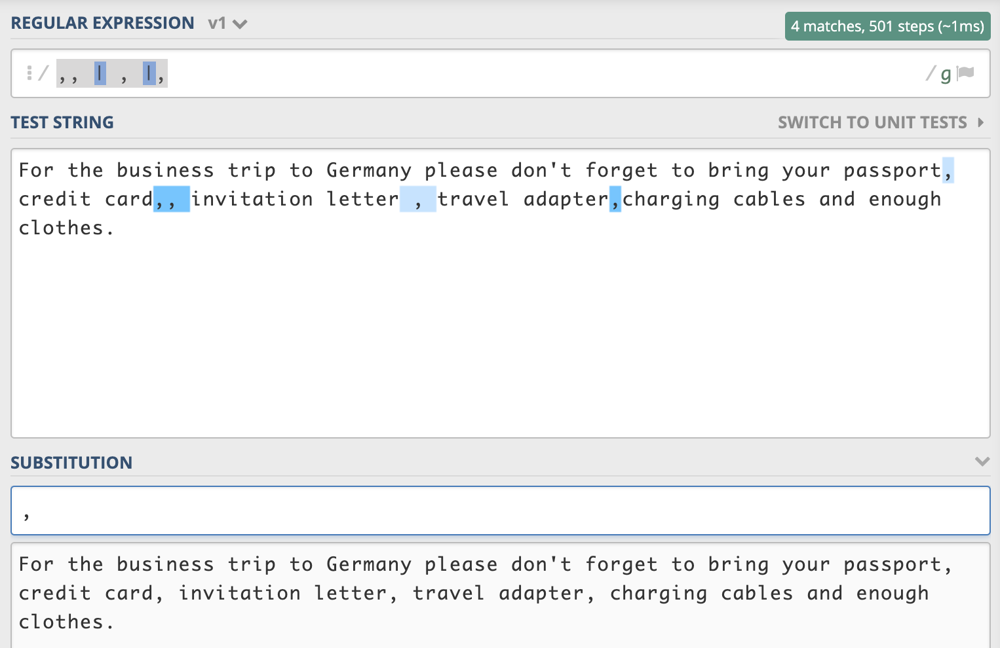
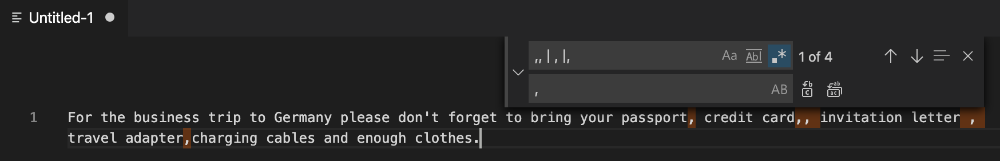

I have given a training during the Corona Virus lockdown in Beijing and as I have prepared most of the scripts using Joplin & Markdown (I think I will write a blogpost soon about Markdown, Joplin & Jekyll) I will publish it here. 

Introduction:
----
Let's try to get an idea what kind of use cases can be supported by using regular expressions. 

### Example 1) - Typos
In the following sentence please decide which words are written wrong.

`In this seeentence someone typed sooooooome words by pressssssssing some keys wayyyyyyyy to loooooong. You see?`

### Example 2) - Copy & Paste Issues, Lists #1
In the following list of travel itinaries have a look at the commas and mark what is wrong.

`For the business trip to Germany please don't forget to bring your passport, credit card,, invitation letter , travel adapter,charging cables and enough clothes.`

### Example 3) - Checking Rules
There is a common rule in scientific and technical writing that you should write numbers out if they are under 10. Which numbers should be written completely as a word?

`3 people, 20 hours, 33 chairs, 11 minutes, 4 days, 5.50€, 3 instances, swine flu H1N1, 7 miles` 

### Example 4) - Copy & Paste Issues, Lists #2
The following list of words got a bad layout:
```plaintext

monkey;
gorilla
sheep

elefant
    zebra


lion
 
```

### Example 5) - Text Analysis
Please transform this example...

`I was born on 11.12.1990 in Berlin. I started working in Beijing 2019-08-01. I will go back to Stuttgart on  2021-07-31.`

...into a list like this:

|Town mentioned | Time mentioned|
|---------------|----------------|
|Berlin      | 111290|
|...|...|
|...|...|

### Conclusion from Example 1 - 5
For the above examples it is quite easy for us (our brain) to identify and fix issues and to solve some conversions like the last one. However when you have a lot of text it would become difficult for us or it just needs a lot of time. Regular Expressions will help us to automate such brainwork.

Motivation for learning Regular Expressions
------

### Why I often use regular expressions:
- clean up / reformat log files
- search & replace (if you have to be precise)
    - deployment
    - parametrization
    - ...
- transform output of legacy systems
- format conversion
- copy paste issues
- data retrieval

### Beeing able to work with regular expressions is allowing:
- Improve work efficiency
- Data Analysis
- Adjust to Changes
- Big Data
- Machine Learning

Usage
---

Let's go one step back and go again to this __Example 1)__:

`In this seeentence someone typed sooooooome words by pressssssssing some keys wayyyyyyyy to loooooong. You see?`

Your eyes are just having a look and the wrong words are nearly found automatically. Processing this sentence by a computer will not do so. In general any text editing program that you use will by default not interprete this text any other then that it is just a text. In order to let a program finding the wrong words you have to explain how to identify it. The commands  to describe that rule is called __Regular Expression__: 

```plaintext
(\w)\1{2,}
```

To see a demo follow this link and you will see how a interpreter for RegEx will highlight the wrong words: [Link](https://regex101.com/r/jcNtDU/1)

What does this regular expression consist of? There are some subcommands/expressions:

Command | Meaning
--------|--------
```\w``` | stands for a character between a-Z. 
```(...)``` | if you put these brackets around something, it will be a group
```\1``` | this is a reference to your first result group(in my example it is the group ```(\w)```
```{2,}``` | Everything inside those brackets is describing some more details for the regular expressions before. In this case we want to find all results, that occur more than two times.

[Regex101.com](Regex101.com) allows you to play around with regex commands and gives you useful hints. 

Please play around with the following rules and check what they do: 

* ```\w```
* ```(\w)```
* ```(\w)\1{2}```
* ```(\w)\1{4,}```
* ```(\w)\1{4}```

As it is a public webservice don't play around with sensitive or internal data. For treating such data I will show you another tool that you can use for that.

The next __Example 2)__...

```For the business trip to Germany please don't forget to bring your passport, credit card,, invitation letter , travel adapter,charging cables and enough clothes.```

...can be cleaned up from wrong placed commas (normally a comma should be set directly after a word followed by a blank before the next word) by using the following regex.

_(Dear Western reader, you might wonder why I go into detail so much about obvious things. Well, these things are not obvious if you use Chinese characters normally)_

* Replace this ```,, | , |, ``` with just a comma and a space


[Demo](https://regex101.com/r/sJoX5S/1)


If you are working with sensitive or internal data I recommend to use a program that supports regular expressions such as [VSCode](https://code.visualstudio.com/).



Command | Meaning
--------|--------
\| | This is the OR-Operator

The above example showed how to easily replace single patterns that occur in one line by specifiying the exact character that we want to look for which was the comma ```,```.

The next __Example 3)__ will a use the expression ```(?<!\S)\d(?!\S)``` to just search for one digit numbers:
```3 people, 20 hours, 33 chairs, 11 minutes, 4 days, 5.50€, 3 instances, swine flu H1N1, 7 miles``` 

[Demo](https://regex101.com/r/lyuCgU/1)

Command | Meaning
--------|--------
```|``` | This is the OR-Operator, to combine multiple search conditions
```(?<!...)```|This is a negative ```!``` so called Lookbehind
```\S```| This matches everything except whitespace (blanks, tabs, newlines...). 
```(?<!\S)```|This is an example for how to combine a negative Lookbehind. It means that we don't want to capture something like H1N1. So if there is e.g. a character before a single number then we won't search for it. 
```(?!...)```|This is a negative Lookahead. See in the 5.50€ we don't want to search for the 5, if it is followed by another character.

Now we come to the __Example 4)__ with the bad layout.

```

monkey;
gorilla
sheep

elefant
    zebra


lion
 
```

We can fix it with the expressions (one operation after another)
* Replace ```\s|;``` by ```@```
* Replace ```@+``` by ```,```
* Replace ```^,|,$``` with nothing

You see, sometimes it makes sense to think of smaller regular expressions and use these ones after another instead of trying to find one big expression that solves your problem in one shot. The benefits of splitting some operations into multiple ones is that you will be able to reuse some smaller operations when you have another topic you want to solve. 

Command | Meaning
--------|--------
+ | whenever something is followed by the + sign it means that there needs to be at least one finding. So @+ will find not just the @ it will also find @@@@@. In a lot of cases you can sometimes it makes no difference if you use it or not, depending what exactly you want to do with it. 
* | I did not use it in this expression, but I want to mention it here, as it is similar like the +, but this means there needs to be a least zero findings (which means like it would be optional). In some expressions it makes a huge difference whether you use + or * or none of them. 

Last but not least let's solve the last puzzle that I have shown in the introductionn as __Example 5)__. 

```plaintext
I was born on 11.12.1990 in Berlin. 
I started working in Beijing 2019-08-01. 
I will go back to Stuttgart on 2021-07-31.
```

You can see that there are two date formats: dd.MM.yyyy and yyyy-MM-dd. First of all let's harmonize it to the yyyy-MM-dd format. 

Replace ```(\d\d)\.(\d\d)\.(\d\d\d\d)``` with ```$3-$2-$1```. [Demo](https://regex101.com/r/Js5clr/1/)

Command | Meaning
--------|--------
$...|in the replace dialog of most editors (or when programming in the return function) the $1 stands for the first group ```()``` in your search pattern. You can easily shift the sequence with it or skip a group in the output. This we will do later. 
\\. | This is actually just a filter for a single dot. The reason why we have to put a backslash in front of it is the next command.
. | As single dot in regex is standing for any character. Check out the [demo](https://regex101.com/r/JtM3gL/1/). You will see that it works fine aswell.

Now lets use the output 
```plaintext
I was born on 1990-12-11 in Berlin. 
I started working in Beijing 2019-08-01. 
I will go back to Stuttgart on 2021-07-31.
```

and find out the places and the time. The target is to have a list like this.
```plaintext
Berlin: 111290
Beijing: 010819
Stuttgart: 310721
```

Using Regular Expressions in Windows Powershell
----
_(Dear Linux/Mac-Fans, don't worry! Just scroll down a bit...)_


Please create a file on your computer which looks like this:

__File 1.txt__
```plaintext
Parameter1 = ABC
Parameter2 = XZY
Parameter3 = 123.456.789.1 //IP-Address
```

If you want to replace some content you can use following commands:
```powershell
(Get-Content '.\file 1.txt') -replace('123.456.789.1','123.456.789.2') | Set-Content '.\file 2.txt'
```

You can use regular expressions for beeing more precise and more flexible:
```powershell
(Get-Content '.\file 1.txt') -replace('\d{1,3}','123') | Set-Content '.\file 3.txt'
```
__Exercise__: 
> Deconstruct the commands mentioned before. Try to find out what ```Get-Content``` does, what ```-replace``` is doing, what's the meaning of ```|``` etc. Last but not least exchange the sequence of the IP address, so that it is reversed. Please only use regular expressions for that. 

__Btw:__ I just used PowerShell here because its easy for employees of big companies to use it without installing additional software. There are a lot of other ways to achieve replacing strings in textfiles. Using the PowerShell is just one. 

Using Regular Expressions in Linux & MacOS
----
Please create a file on your machine which looks like this:

__File 1.txt__
```plaintext
Parameter1 = ABC
Parameter2 = XZY
Parameter3 = 123.456.789.1 //IP-Address
```

If you want to replace some content you can use following commands:
```bash
cd /Users/leon/regexfile
perl -0777 -i -pe "s|123.456.789.1|123.456.789.2|g" "File 1.txt"
```

You can use regular expressions for beeing more precise and more flexible:
```bash
cd /Users/leon/regexfile
perl -0777 -i -pe "s|\d{1,3}|123|g" "File 1.txt"
```

__Exercise__: 
> Deconstruct the commands mentioned before. Try to find out what each command does, what e.g. `-0777` is doing.

Additional Resources
-----

I could now continue this article, but actually as Regular Expressions are kind of a small language, there are a lot of things you can solve with it. If you want to get an overview of all the commands you can search on google/baidu/bing for "regex cheatsheet". 

Practice makes perfect. :)


