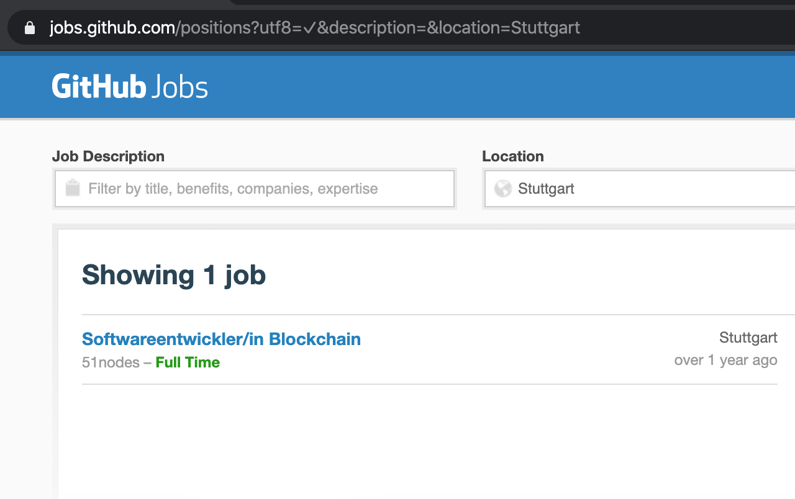
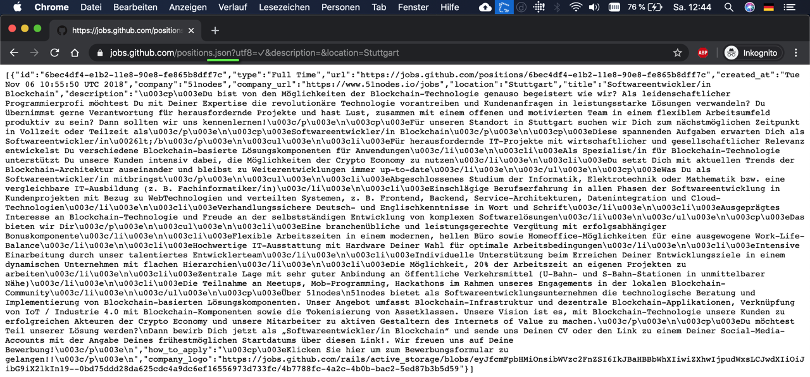
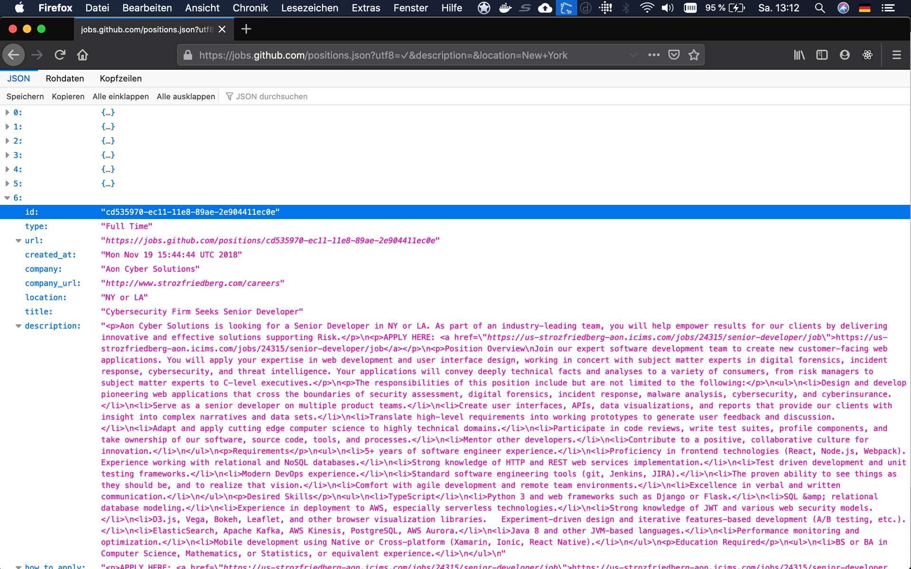
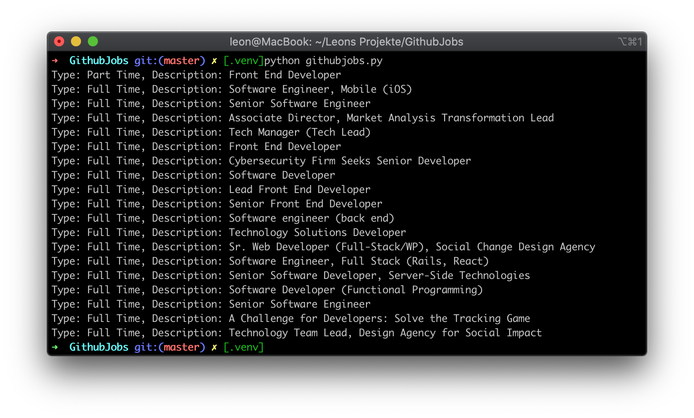

This blog post is about something that now a lot of traditional companies have on their agenda when it's about how to implement their digitization strategy: APIs - Application Programming Interfaces. 

## Intro

Actually APIs are nothing new. I got in touch with my first API in 2005. It was the Windows API that should help me make a big step in my C++ learning path when I was 14 years old. After reading a 1349 pages in a book that a lot of Windows enthusiasts just called ["The Petsold"](https://www.amazon.de/Windows-Programmierung-Das-Entwicklerhandbuch-zur-WIN32-API/dp/3860631888) I got following understanding what APIs are.

APIs enable you to use in your appplication the functions of another application. What is an application? It can be an HTML document, an Excel file, a typical Desktop Application, a Smartphone App, the operating system or an old legacy system. The driver of your mouse or keyboard is also an application. And in the moment that you press a button other applications react.

There are proprietary interfaces for that (e.g. the Windows API that I got in touch with relies on programming in C, C++, C#) or more open APIs. For the last ones I want to highlight here the so called REST-APIs that follow the mechanisms of the world wide web. If you want to know more about REST and HTTP I recommend [this](https://www.amazon.de/dp/3864901200/ref=pe_3044161_185740101_TE_item) Book. 

## Job-API

Today let's have a look into such a REST-API: The __Github Jobs API__. As Github-User I sometimes see some job advertisement and actually never really spend some time on clicking on them because there are so many job platforms nowadays spreading positions over the WWW. However sometimes I am interested what other companies technology stack is looking like. From reading job offers you can get a glimpse of whether candidates should know Java or Python or if companies are looking for IT project managers, supplier managers or for inhouse developers which gives you a good hint whether they follow an insourcing strategy or outsourcing strategy. You can also see if companies grow or shrink, by having a look on how many job postings they have. I used to use __LinkedIn__ for that kind of research and I still do. For automating such things or for a nice visualization (I want to write another blog post about that) browsing with the Webbrowser trough such info, copy & pasting content (including a lot of design things) could be much effort and it would be too much input.

Github is offering such job postings as an open API. There is no registration needed, no authorization key and the service is completely for free. Other companies are more restrictive. You need an account, sometimes you have to register as a company. It's not useful, when "Playing around" with an API. 


## Getting an example running

### Finding Jobs in Stuttgart (the most easy way)

You can use the Github-Jobs website to search for jobs, by just filling the form that shows up there. This is already an API call that most of people do everyday, without really thinking about it. Your browser (application 1) is using a function of the website (application 2). You can see in the url what happens after you searched by filling in the form. A command will be send from the browser in form of the url to the webserver of github. 

[https://jobs.github.com/positions?utf8=%E2%9C%93&description=&location=Stuttgart](https://jobs.github.com/positions?utf8=%E2%9C%93&description=&location=Stuttgart)




Your browser will inform the webserver that actually he expects html (that's what browser do by default).

Seeing only one Job offer there that is over 1 year old, shows me that in Germany this job platform seems not to be very popular yet. Or is it a Stuttgart phenomenom?

### Finding Jobs in Stuttgart (the easy way for getting raw data)

Another way of showing such job results would be to not ask for a HTML result, but for another **representation** (**RE**ST). If we want the representation of the job results as a JSON format we can change the URL to explicetly tell the webserver, what we would like as a result. This we can achieve by passing the extension ".json" to the positions. 

[https://jobs.github.com/positions.json?utf8=%E2%9C%93&description=&location=Stuttgart](https://jobs.github.com/positions.json?utf8=%E2%9C%93&description=&location=Stuttgart)



Ooops... actually the result looks a bit like now we got even more data than before. And in Google Chrome it also looks quite unstructured. Interesting here is that actually the json-file includes the complete job description aswell, whereas the HTML representation did not. If you want a nicer structure of the .json-Format I suggest to open the same URL in Firefox. 

The next link will show a representation for the .atom format. Also here you will see a different format and the full description. 

[https://jobs.github.com/positions.atom?utf8=%E2%9C%93&description=&location=Stuttgart](https://jobs.github.com/positions.atom?utf8=%E2%9C%93&description=&location=Stuttgart)

.atom is an extension for RSS-Readers. So lessons learned -> different use case, different representation. 

However depending on the data that we want to work with it might be a bit too much, to see all this data first. It seems like there is no additional parameter that we can attach to the url to tell Github to send us just the jobtitle instead of the whole description. You can see the full API description on [https://jobs.github.com/api](https://jobs.github.com/api). 

### Filtering such requests (the techie way of getting the data) + calculate something out of it 

Where Stuttgart was a quite easy example to show you what representations are and how to request them the easy way, we will now look into the location "New York":

[https://jobs.github.com/positions.json?utf8=%E2%9C%93&description=&location=New+York](https://jobs.github.com/positions.json?utf8=%E2%9C%93&description=&location=New+York)



This time I opened it in Firefox, to show you a much more structured view on the same representation (the browser is taking care of the nice structure and colors).

You can see there are multiple jobs with ids, type, company name, etc. 

Now we will reduce this .json output just to show us all the type of job and the job titles. For this we use the programming language python. 
(This is not a python training, the following source code is not working without some small steps before)

```python
import requests, json
for job in requests.get("https://jobs.github.com/positions.json?utf8=%E2%9C%93&description=&location=New+York").json():
    print("Type: {0}, Description: {1}".format(job['type'], job['title']))
```



So far this is nothing new to us. How about calculating how many Developers are needed in New York and how many other people? Let's calculate a ratio. 

```python
import requests, json
dev_count=0
other_count=0
for job in requests.get("https://jobs.github.com/positions.json?utf8=%E2%9C%93&description=&location=New+York").json():
    print("Type: {0}, Description: {1}".format(job['type'], job['title']))
    if ("Developer" in job['title']) or ("Engineer" in job['title']):
        dev_count+=1
    else:
        other_count+=1
print("Developerjobs: {0}, Other jobs: {1}".format(dev_count, other_count))
print("Developer-Ratio: {0:.2%}".format(dev_count/(dev_count + other_count)))
```


So you see, what APIs can be good for and you should now have the knowledge to use them and calculate cool things with data that comes from somewhere else.

When playing around with APIs, better read the terms & conditions of the supplier. 