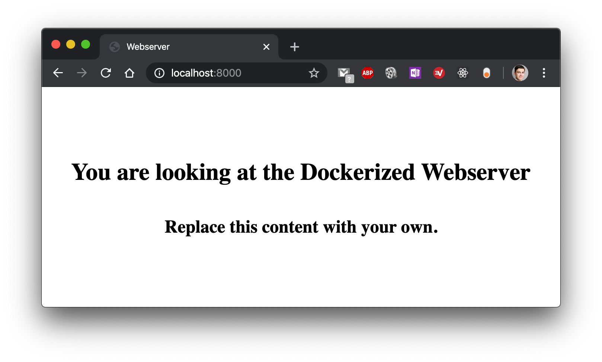
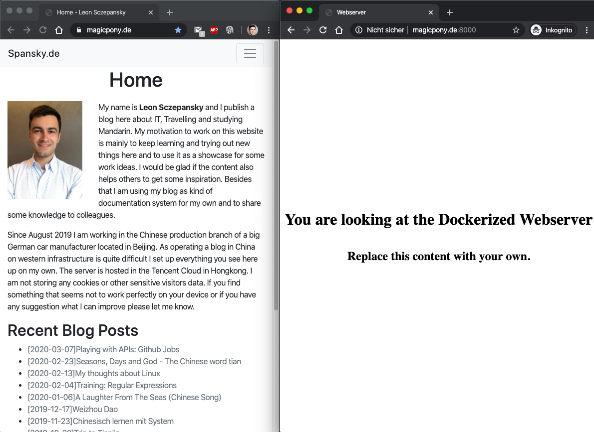

## Current Situation:
I have a Linux system installed on a virtual machine from Tencent. On this machine I have various packages where I am not aware anymore if they came with the VM by default or if I installed them to try something out. Then I have created a small webapp based on Python-Flask. First this app was running in debug mode without a webserver. Then it got the first users which then of course should be asured that this webservice would be available 24/7. I then have installed Apache to also host a HTML-written website (no CMS) and then later to shift the Flask-Webapplication to it. As writing HTML manually was a bit overhead I decided later to install a Content Management System which was Mezzanine. I hoped that this Python-based open source project would be easy to mix with my webapp just mentioned. However it turned out that Mezzanine was not the way to go forward for me as getting it run stable in China was a mess because of the Chinese characters triggering a lot of false positives in Apaches mod_security plugin. I then went back to HTML only and for already certain months I am using the static webpage generator to automatically derive them from Markdown text which saves me some effort without giving up control. To prepare my blog I am using the Notes Taking app Joplin and save its text files on my server in a WEBDAV folder. Still my website is not listed on Google because I don't think it is ready yet. So there will still be ongoing changes. Also in future...

* a blog
* at least one webapp
* a WEBDAV

...should be part of my website/server. What's more: I plan to host some other webservices that even need a different domain. Apache offers great options to set this up using just one Apache server, however I would then have the challenge that each of these websites would be still connected to the same Apache server. If I adjust just one website's configuration in Apache I would have to test all websites as I could have broken something. I think that makes a case for using Docker Containers. Some benefits I will describe below.

## Motivation:
* **Streamline Development Laptop, Integration Machine and Production System:** Currently I am using a Macbook for development and two VMs for integration tests and production. Both Linux systems are reachable in the WWW. After experiencing issues with certificates I think it makes sense to run the integration system for a website under some kind of dummy-Domain. Otherwise it will be hard to test e.g. if your certbot (used for SSL Provider Let's Encrypt) is still working. To keep those systems in sync is a tough job, especially because the OS setup is normally nothing that you would put into a versioning system. And even if I would do that. I would nether be able to have the same config of my MacBook running on the Linux Server. There would always be a difference that brings potential issues. 
* Different **Security Settings** for different use cases possible: Whereas the static files webserver should handle all requests, you could put your webapplication behind a reverse proxy that only allows a whitelist of requests to pass, e.g. to avoid scanners access your '.../admin/'-URL, e.g. in wordpress or any other CMS. Also here the big benefit of docker is that you can change Webservice A without touching Webservice B. Especially changes in Apache Mod Secure had some severe sideeffects on some webapplications that I actually did not want to change at all. 
* **Supplier / Host Flexibility:** Currently I am hosting on Tencent. How about shifting to Alibaba? Especially as an expatriate there might be the day where I go back to Europe and feel the need to host my stuff on AWS or somewhere else.
* **Templates:** If I have a new idea I can copy & paste my template webserver and start quite fast without having to worry about breaking my currently running website. 
* **Continuos Integration, Continuos Deployment:** So far I am not doing it for my website yet, but it is definetly on my TODO list. 
* **Add more comfort** to your host operating system. On my Mac I am using ZSH paired with the project "Oh my Zsh" to add a lot of autocomplete functions to my command line. Whereas this might be very handy on your private system, this could be a high potential risk to break your whole configuration. Especially on a production system I would not do such things. With dockerized application logic you can simply change anything but docker and you will not have any side effect. Just make sure docker is running, then also the contained services will run as before. 

## Step 1) Install Docker
**Please notice: After following the steps, in the end you will have a docker container with Apache and a self signed certificate running on your localhost. This is not a tutorial for getting things run on production, as I will point out later.**

* updating the current operating system `sudo yum update`
* installing docker following [this](https://docs.docker.com/install/linux/docker-ce/centos/) installation guide:
    * `sudo yum install -y yum-utils \
  device-mapper-persistent-data \
  lvm2`
    * `sudo yum-config-manager \
    --add-repo \
    https://download.docker.com/linux/centos/docker-ce.repo`
    * `sudo yum install docker-ce docker-ce-cli containerd.io`
* Starting docker `sudo systemctl start docker`
* Testing docker `sudo docker run --rm hello-world` (with the --rm we avoid that we have to clean up after the docker container exits. )
* `sudo usermod -aG docker $USER`: Add my current user to the group of users that is able to run docker commands without `sudo` in front of it. 
* Run Docker on Startup `sudo systemctl enable docker`

## Step 2) Create a new Git-Repository for the Webserver and set up basic config
My workflow for that step is to first create the repository on Github, then clone it to my laptop. 

Following steps I have done...

* Create repository "apache-in-a-docker"
* Clone it via `git clone https://github.com/<your-git-account-here>/apache-in-a-docker.git`
* `cd <your folder>/apache-in-a-docker`
* This repository will have following target structure:
	```plaintext
	__apache-in-a-docker 
	   |__public-html
	   |   |__index.html
	   |
	   |__Dockerfile
	   |__httpd.conf
	   |__README.md
	```

* Create a Dockerfile
	```dockerfile
	FROM alpine:latest
	ENV apache_port=80
	RUN apk add --no-cache apache2
	RUN rm -rf /var/www/localhost/cgi-bin/
	COPY $PWD/httpd.conf /etc/aoache2/httpd.conf
	COPY $PWD/public-html/ /var/www/localhost/htdocs/
	EXPOSE ${apache_port}
	CMD exec /usr/sbin/httpd -D FOREGROUND -f /etc/apache2/httpd.conf
	```

* Create a httpd(Apache)-configuration (as this is more or less security relevant, I will not share my file here). In general I tend to get some inspiration of the default apache config file that you can get via 
`docker run --rm httpd:2.4 cat /usr/local/apache2/conf/httpd.conf > my-httpd.conf`.


* Create a dummy index.html for testing
	```html
	<!DOCTYPE html>
	<html lang="en">
	<head>
	    <meta charset="UTF-8">
	    <meta name="viewport" content="width=device-width, initial-scale=1.0">
	    <title>Webserver</title>
	    <style>
	        body {
	            margin: 0;
	            width: 100%;
	            display: flex;
	            flex-direction: column;
	            justify-content: center;
	            align-content: center;
	            height: 100vh;
	            align-items: center;
	        }
	    </style>
	</head>
	<body>
	    <h1>You are looking at the Dockerized Webserver</h1>
	    <h2>Replace this content with your own.</h2>
	</body>
	</html>
	```

* Build the docker image and run a container for testing:
	```bash
	cn="aiad" && ap=80 # container name = image name, port
	docker build -t $cn":latest" .
	docker run -d --rm -p 8000:$ap -e "apache_port=$ap" --name=$cn $cn":latest"
	```



## Step 3) Publish the Service to the Testsystem (my Testsystem is in the WWW)

For convenience of pushing and pulling the image from DEV to INT to PROD I use Dockerhub as repository for the images.

* `du=<username>`
* rename the tag `docker tag $cn":latest" $du/$cn":latest"`
* push the image to the Dockerhub-Repository `docker push $du/$cn":latest"`

Now I switch to the Test System where I installed Docker before. 

```bash
cn="aiad" && ap=80 && du="<username>" && tag=":latest"
```

```bash
docker login -user $du
docker pull $du"/"$cn$tag
```

* there I will now run it via 

```bash
docker run -d --rm -p 8000:$ap \
	-e "apache_port=$ap" \
	--name=$cn $du"/"$cn$tag
```

And here we are... now the original Test-Apacheserver is running next to a dockerized version



What bugs me a bit is not that the content is still missing on the right. It is the missing HTTPS encryption. Copying the content from folder A to dockerized folder B can be solved by the -v command of Docker. 

However the certificate thing is a bit more complicated and propably would make this quite easy blog article a not so easy one. (I write this sentence after having tried out a whole day how to get it running and I am actually surprised that there are not so many articles in the WWW covering how to run an Apache inside of Docker + SSL. For Nginx there are much more. What caused me problems is the fact that I am having the certificate from Let's Encrypt in my main Apache - left picture. I thought I could pass those via `-v /etc/letsencrypt/live/magicpony.de/:/etc/letsencrypt/live/magicpony.de/` from the host to the docker and everything would be OK. It's not. I think I have to learn a bit more about that. I will keep you updated.)